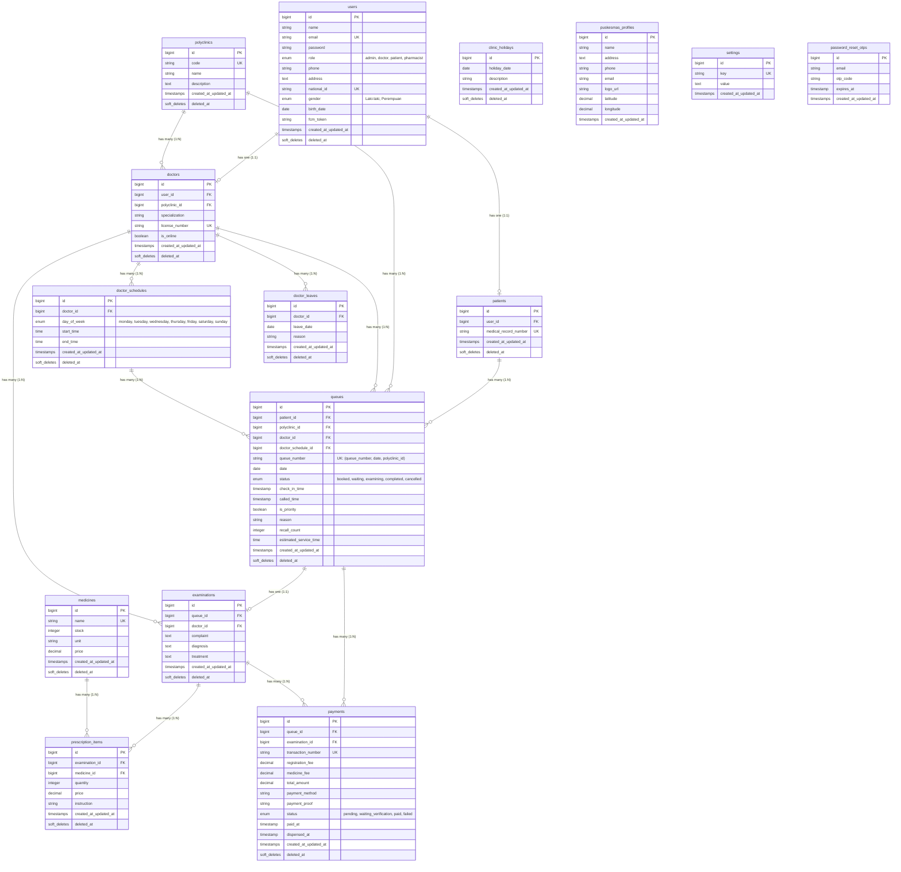

# Entity-Relationship Diagram (ERD) - NalaSeva API (Updated)

Berikut adalah **Entity-Relationship Diagram (ERD)** untuk sistem **NalaSeva** yang telah diperbarui berdasarkan masukan *best practice* untuk integritas data, relasi pembayaran jamak, dan indeks komposit unik pada antrean.

---

## 📊 Diagram ERD (Mermaid)

---

## 🔑 Penjelasan Relasi & Indeks Baru (*Best Practice Updates*)

1. **`examinations` & `queues` ➔ `payments` (One-to-Many / `1:N`)**
   - **Perubahan:** Dari sebelumnya digambarkan sebagai One-to-One (`1:1`), kini dirancang sebagai **One-to-Many (`1:N`)**.
   - **Alasan:** Memungkinkan skenario di mana satu pemeriksaan/kunjungan memiliki lebih dari satu transaksi pembayaran (misal: pembayaran pendaftaran awal dibayar terpisah dengan biaya penebusan resep obat).

2. **`doctor_schedules.day_of_week` (Menggunakan Enum Bahasa Inggris)**
   - **Perubahan:** Kolom ini di tingkat database bertipe `enum('monday', 'tuesday', 'wednesday', 'thursday', 'friday', 'saturday', 'sunday')`.
   - **Karakteristik:** Menggunakan standar bahasa Inggris di level database untuk kompabilitas datetime, dan secara otomatis dikonversi ke bahasa Indonesia (`Senin` - `Minggu`) oleh model Eloquent Laravel (`DoctorSchedule.php`) saat disajikan ke aplikasi.

3. **`doctors.license_number` (Unique / `UK`)**
   - **Perubahan:** Kolom nomor izin praktik (**SIP**) dokter didefinisikan sebagai indeks unik.
   - **Alasan:** Menghindari pendaftaran ganda dari data dokter yang sama.

4. **`queues.queue_number` (Composite Unique Index / `UK`)**
   - **Perubahan:** Ditambahkan indeks unik komposit pada kombinasi kolom `(queue_number, date, polyclinic_id)`.
   - **Alasan:** Menjamin tidak ada nomor antrean duplikat pada tanggal yang sama untuk poliklinik yang sama, namun tetap mendukung nomor antrean yang sama untuk digunakan di poliklinik lain atau pada hari yang berbeda.

5. **Dukungan Kunjungan Jamak Pasien (Multi-Visits)**
   - Model `queues` saat ini sudah **mendukung penuh** skenario jika seorang pasien melakukan kunjungan lebih dari sekali ke poliklinik yang sama dalam satu hari di jam berbeda. Hal ini dikarenakan setiap sesi kunjungan direpresentasikan oleh baris baru (*new record*) di tabel `queues` yang memuat ID uniknya sendiri (`queues.id`).
