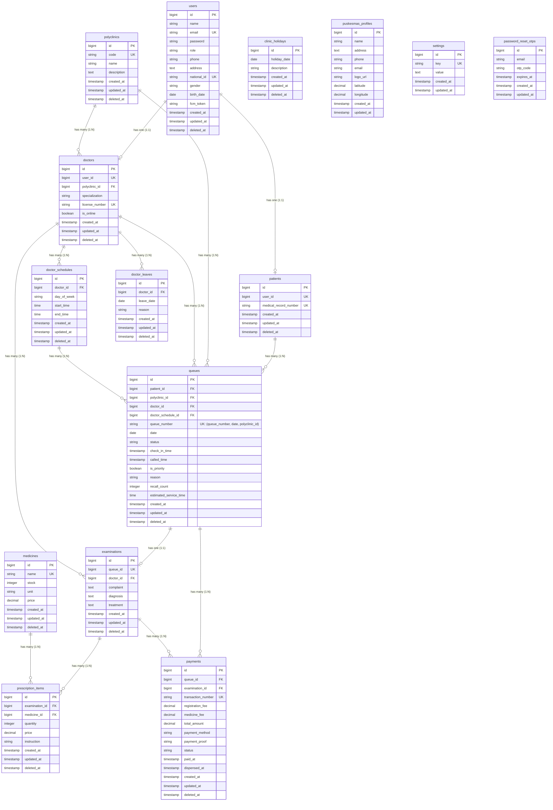

# Entity-Relationship Diagram (ERD) - NalaSeva API (Updated)

Berikut adalah **Entity-Relationship Diagram (ERD)** untuk sistem **NalaSeva** yang telah diperbarui berdasarkan masukan *best practice* untuk integritas data, relasi pembayaran jamak, dan indeks komposit unik pada antrean.

---

## 📊 Diagram ERD (Mermaid - Rendered on GitHub)



---

### 🛠️ Kode Schema DBML (Untuk dbdiagram.io)

```dbml
TableGroup "Master Data" {
  users
  patients
  polyclinics
  doctors
  medicines
}

TableGroup "Doctor Management" {
  doctor_schedules
  doctor_leaves
}

TableGroup "Medical Services" {
  queues
  examinations
  prescription_items
  payments
}

TableGroup "System Configuration" {
  clinic_holidays
  puskesmas_profiles
  settings
  password_reset_otps
}

Table users {
  id bigint [pk]
  name varchar
  email varchar [unique]
  password varchar
  role varchar
  phone varchar
  address text
  national_id varchar [unique]
  gender varchar
  birth_date date
  fcm_token varchar
  created_at timestamp
  updated_at timestamp
  deleted_at timestamp
}

Table patients {
  id bigint [pk]
  user_id bigint [unique]
  medical_record_number varchar [unique]
  created_at timestamp
  updated_at timestamp
  deleted_at timestamp
}

Table polyclinics {
  id bigint [pk]
  code varchar [unique]
  name varchar
  description text
  created_at timestamp
  updated_at timestamp
  deleted_at timestamp
}

Table doctors {
  id bigint [pk]
  user_id bigint [unique]
  polyclinic_id bigint
  specialization varchar
  license_number varchar [unique]
  is_online boolean
  created_at timestamp
  updated_at timestamp
  deleted_at timestamp
}

Table medicines {
  id bigint [pk]
  name varchar [unique]
  stock integer
  unit varchar
  price decimal
  created_at timestamp
  updated_at timestamp
  deleted_at timestamp
}

Table doctor_schedules {
  id bigint [pk]
  doctor_id bigint
  day_of_week varchar
  start_time time
  end_time time
  created_at timestamp
  updated_at timestamp
  deleted_at timestamp
}

Table doctor_leaves {
  id bigint [pk]
  doctor_id bigint
  leave_date date
  reason varchar
  created_at timestamp
  updated_at timestamp
  deleted_at timestamp
}

Table queues {
  id bigint [pk]
  patient_id bigint
  polyclinic_id bigint
  doctor_id bigint
  doctor_schedule_id bigint
  queue_number varchar
  date date
  status varchar
  check_in_time timestamp
  called_time timestamp
  is_priority boolean
  reason varchar
  recall_count integer
  estimated_service_time time
  created_at timestamp
  updated_at timestamp
  deleted_at timestamp

  Indexes {
    (queue_number, date, polyclinic_id) [unique]
  }
}

Table examinations {
  id bigint [pk]
  queue_id bigint [unique]
  doctor_id bigint
  complaint text
  diagnosis text
  treatment text
  created_at timestamp
  updated_at timestamp
  deleted_at timestamp
}

Table prescription_items {
  id bigint [pk]
  examination_id bigint
  medicine_id bigint
  quantity integer
  price decimal
  instruction varchar
  created_at timestamp
  updated_at timestamp
  deleted_at timestamp
}

Table payments {
  id bigint [pk]
  queue_id bigint
  examination_id bigint
  transaction_number varchar [unique]
  registration_fee decimal
  medicine_fee decimal
  total_amount decimal
  payment_method varchar
  payment_proof varchar
  status varchar
  paid_at timestamp
  dispensed_at timestamp
  created_at timestamp
  updated_at timestamp
  deleted_at timestamp
}

Table clinic_holidays {
  id bigint [pk]
  holiday_date date
  description varchar
  created_at timestamp
  updated_at timestamp
  deleted_at timestamp
}

Table puskesmas_profiles {
  id bigint [pk]
  name varchar
  address text
  phone varchar
  email varchar
  logo_url varchar
  latitude decimal
  longitude decimal
  created_at timestamp
  updated_at timestamp
}

Table settings {
  id bigint [pk]
  key varchar [unique]
  value text
  created_at timestamp
  updated_at timestamp
}

Table password_reset_otps {
  id bigint [pk]
  email varchar
  otp_code varchar
  expires_at timestamp
  created_at timestamp
  updated_at timestamp
}

Ref: patients.user_id - users.id
Ref: doctors.user_id - users.id

Ref: doctors.polyclinic_id > polyclinics.id

Ref: doctor_schedules.doctor_id > doctors.id
Ref: doctor_leaves.doctor_id > doctors.id

Ref: queues.patient_id > patients.id
Ref: queues.polyclinic_id > polyclinics.id
Ref: queues.doctor_id > doctors.id
Ref: queues.doctor_schedule_id > doctor_schedules.id

Ref: examinations.queue_id - queues.id
Ref: examinations.doctor_id > doctors.id

Ref: prescription_items.examination_id > examinations.id
Ref: prescription_items.medicine_id > medicines.id

Ref: payments.queue_id > queues.id
Ref: payments.examination_id > examinations.id
```

---

## 🔑 Penjelasan Relasi & Indeks Baru (*Best Practice Updates*)

1. **`examinations` & `queues` ➔ `payments` (One-to-Many / `1:N`)**
   - **Perubahan:** Dari sebelumnya digambarkan sebagai One-to-One (`1:1`), kini dirancang sebagai **One-to-Many (`1:N`)**.
   - **Alasan:** Memungkinkan skenario di mana satu pemeriksaan/kunjungan memiliki lebih dari satu transaksi pembayaran (misal: pembayaran pendaftaran awal dibayar terpisah dengan biaya penebusan resep obat).

2. **`doctor_schedules.day_of_week` (Menggunakan Enum Bahasa Inggris)**
   - **Perubahan:** Kolom ini di tingkat database bertipe `enum('monday', 'tuesday', 'wednesday', 'thursday', 'friday', 'saturday', 'sunday')`.
   - **Karakteristik:** Menggunakan standar bahasa Inggris di level database untuk kompabilitas datetime, dan secara otomatis dikonversi ke bahasa Indonesia (`Senin` - `Minggu`) oleh model Eloquent Laravel (`DoctorSchedule.php`) saat disajikan ke aplikasi.

3. **`doctors.license_number` (Unique / `UK`)**
   - **Perubahan:** Kolom nomor izin praktik (**SIP**) dokter didefinisikan sebagai indeks unik.
   - **Alasan:** Menghindari pendaftaran ganda dari data dokter yang sama.

4. **`queues.queue_number` (Composite Unique Index / `UK`)**
   - **Perubahan:** Ditambahkan indeks unik komposit pada kombinasi kolom `(queue_number, date, polyclinic_id)`.
   - **Alasan:** Menjamin tidak ada nomor antrean duplikat pada tanggal yang sama untuk poliklinik yang sama, namun tetap mendukung nomor antrean yang sama untuk digunakan di poliklinik lain atau pada hari yang berbeda.

5. **Dukungan Kunjungan Jamak Pasien (Multi-Visits)**
   - Model `queues` saat ini sudah **mendukung penuh** skenario jika seorang pasien melakukan kunjungan lebih dari sekali ke poliklinik yang sama dalam satu hari di jam berbeda. Hal ini dikarenakan setiap sesi kunjungan direpresentasikan oleh baris baru (*new record*) di tabel `queues` yang memuat ID uniknya sendiri (`queues.id`).
