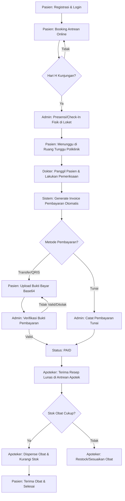
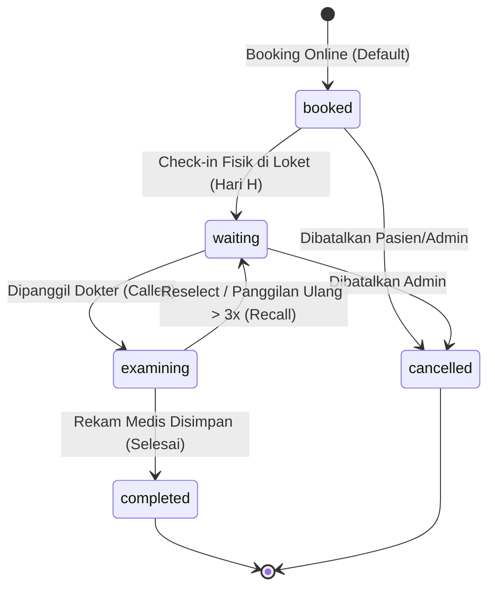

# Alur Bisnis Sistem NalaSeva API

Dokumen ini menjelaskan secara mendetail dan akurat seluruh alur bisnis (business workflow) yang berjalan pada sistem **NalaSeva**, berdasarkan hasil verifikasi langsung dari source code model, controller, service, dan schema database aktif.

---

## 👥 Aktor Sistem & Hak Akses
Sistem NalaSeva didesain dengan kontrol akses berbasis peran (*Role-Based Access Control* atau RBAC) yang terbagi menjadi empat aktor utama:
1. **Pasien (`patient`)**: Melakukan registrasi mandiri, mengelola profil pribadi, memesan antrean poliklinik secara online, melakukan check-in mandiri, mengunggah bukti pembayaran, serta melihat riwayat rekam medis dan transaksi pribadinya.
2. **Dokter (`doctor`)**: Mengatur status ketersediaan pelayanan secara real-time, memanggil pasien di ruang periksa, melakukan pemeriksaan medis, mencatat diagnosis, tindakan, dan memberikan resep obat digital.
3. **Apoteker/Apotek (`pharmacist`)**: Mengelola katalog obat, memantau daftar resep obat dari pasien yang pembayarannya telah lunas, memverifikasi ketersediaan stok fisik obat, dan melakukan serah terima obat (*dispensing*).
4. **Administrator (`admin`)**: Mengelola data master (pengguna, dokter, pasien, poliklinik, obat), mengatur jadwal shift praktik dokter, menetapkan kalender hari libur operasional puskesmas, memproses cuti dokter, memverifikasi bukti pembayaran transfer/QRIS, serta mencatat pembayaran tunai langsung di kasir loket.

---

## 🔄 Diagram Alur Bisnis Utama (End-to-End Flow)

Berikut adalah visualisasi diagram alur pelayanan pasien secara menyeluruh, sejak pendaftaran akun hingga pengambilan obat:

---

## ⚙️ Detail Proses Bisnis per Modul

### 1. Registrasi Akun & Manajemen Rekam Medis (RM) Pasien
Modul ini menangani daftarnya pasien baru baik secara mandiri (melalui aplikasi mobile) maupun dibantu oleh admin loket di Puskesmas.

*   **Pendaftaran Mandiri Pasien (`POST /api/auth/register`)**:
    *   Pasien memasukkan NIK (16 digit), Nama, Email, Password, No. HP, Jenis Kelamin, Tanggal Lahir, dan Alamat.
    *   **Validasi Keunikan**: Sistem memvalidasi bahwa alamat Email dan NIK belum terdaftar dan aktif di database (mengabaikan record yang telah di-*soft delete*).
    *   **Database Transaction**: Proses pendaftaran dibungkus dalam transaksi database. Sistem secara bersamaan membuat baris baru di tabel `users` (dengan peran `patient`) dan di tabel `patients`.
    *   **Auto-Generate No. Rekam Medis**: Saat model `Patient` dibuat, sistem memicu event `creating` di boot model untuk menggenerate nomor rekam medis unik secara otomatis dengan format:
        `NS-[YYYYMMDD]-[HHMMSS]-[3 Digit Acak]` (Contoh: `NS-20260612-084512-482`).
*   **Permintaan OTP & Reset Password**:
    *   Pasien meminta kode OTP (`POST /api/auth/forgot-password/otp`) dengan menyertakan Email dan NIK.
    *   Jika data cocok, kode OTP 6-digit dibuat, dimasukkan ke tabel `password_reset_otps` dengan masa kedaluwarsa 15 menit, lalu dikirim via email.
    *   Reset password dilakukan via `POST /api/auth/forgot-password` menggunakan OTP. Jika berhasil, sistem menghapus OTP dari database dan membatalkan semua token login aktif (`tokens()->delete()`) untuk memaksa login ulang.

---

### 2. Pemesanan Antrean Poliklinik secara Online (Queue Booking)
Modul pendaftaran antrean merupakan bagian paling kompleks yang dilengkapi validasi bertahap untuk mencegah data ganda, bentrok jadwal, dan penunggakan tagihan.

*   **Pembatasan Rate Limit (*Throttling*)**: Endpoint booking dibatasi maksimal `5 request per menit` per IP untuk mengamankan server dari serangan spamming.
*   **Prosedur Validasi 8 Lapis (DB lockForUpdate)**:
    Saat pasien menekan tombol booking, sistem melakukan serangkaian pemeriksaan ketat di dalam transaksi database yang terproteksi oleh `lockForUpdate()`:
    1.  **Batas Tanggal Pemesanan (*Time Window Validation*)**: Booking hanya diperbolehkan dari H-7 hingga hari H sebelum pelayanan dimulai. Tanggal di masa lalu atau H+8 ke atas ditolak.
    2.  **Hari Libur Puskesmas**: Sistem memeriksa tabel `clinic_holidays`. Jika tanggal kunjungan terdaftar sebagai hari libur, pendaftaran digagalkan.
    3.  **Cuti Dokter**: Sistem memeriksa tabel `doctor_leaves`. Jika dokter terpilih sedang mengambil cuti pada tanggal tersebut, pendaftaran digagalkan.
    4.  **Kecocokan Jadwal Dokter**: Jadwal shift (`doctor_schedules.day_of_week`) harus cocok dengan nama hari pada tanggal pemesanan, serta harus sesuai dengan poliklinik tempat dokter ditugaskan.
    5.  **Pencegahan Penunggakan Pembayaran**: Sistem melacak invoice pasien yang berstatus `pending`. Jika ditemukan invoice menunggak yang telah berumur lebih dari 24 jam (`created_at < 24 jam yang lalu`), pasien dilarang membuat antrean baru sebelum melunasi tagihan lama tersebut.
    6.  **Antrean Ganda Poliklinik**: Pasien tidak boleh memiliki antrean aktif (kecuali berstatus `cancelled`) di poliklinik yang sama pada tanggal kunjungan yang sama.
    7.  **Bentrokan Jam Pelayanan Lintas Poliklinik**: Jika pasien memesan antrean di poliklinik yang berbeda pada tanggal yang sama, sistem memverifikasi bahwa jam praktik dokter tidak saling tumpang tindih (*overlap*). Jika bentrok, pendaftaran ditolak.
    8.  **Kuota Kapasitas Dokter**: Kuota dihitung secara dinamis berdasarkan rumus:
        $$\text{Kuota} = \text{floor}\left(\frac{\text{Durasi Praktik (menit)}}{15}\right)$$
        *(jika durasi $\le 0$, fallback ke 10 pasien)*. Jika antrean aktif pada shift tersebut telah memenuhi kuota, booking dibatalkan.
*   **Penomoran Antrean**:
    Sistem mengambil kode poliklinik (contoh: `POL-GIG` memiliki kode `GIG`) dan mencari nomor antrean terbesar pada hari tersebut (termasuk antrean terhapus via `withTrashed()`). Nomor urut berikutnya di-increment secara otomatis (contoh: `GIG-001`, `GIG-002`).
*   **Prioritas Usia Otomatis**:
    Sistem menghitung umur pasien saat pendaftaran berdasarkan `birth_date`. Jika umur pasien $\ge 60$ tahun, status antrean otomatis ditandai sebagai prioritas (`is_priority = true`).
*   **Perhitungan Estimasi Waktu Pelayanan (*Estimated Service Time*)**:
    *   Posisi tunggu (`position_waiting`) dihitung dengan logika prioritas: Pasien prioritas hanya menunggu pasien prioritas lain yang datang lebih dulu + pasien reguler/prioritas yang sedang di ruang periksa (`examining`). Pasien reguler harus menunggu semua pasien prioritas + pasien reguler lainnya yang datang lebih dulu.
    *   Estimasi jam pelayanan dihitung dari waktu mulai shift dokter (atau waktu sekarang, mana yang lebih lambat) ditambah `(posisi tunggu x durasi_slot_menit)`.
    *   Setiap kali ada antrean baru, check-in, pembatalan, pelewatan, atau pemanggilan, sistem secara otomatis menghitung ulang seluruh estimasi waktu pelayanan pasien lain di poliklinik tersebut pada hari itu.

---

### 3. Presensi Fisik & Check-In di Loket Puskesmas
Proses check-in memvalidasi kedatangan fisik pasien di Puskesmas pada hari pelaksanaan pemeriksaan.

*   **Presensi Loket (`POST /api/queues/{id}/checkin`)**:
    *   Dilakukan oleh Admin Loket dengan memindai QR Code tiket antrean milik pasien.
    *   **Validasi Tanggal**: Check-in hanya valid dilakukan pada hari H tanggal kunjungan.
    *   **Batas Waktu Toleransi**: Sistem menghitung selisih waktu sekarang dengan estimasi waktu pelayanan pasien. Check-in ditolak jika waktu saat ini telah melewati batas toleransi 2 jam setelah estimasi pelayanan (`estimated_service_time + 2 jam`).
    *   **Perubahan Status**: Status antrean berubah dari `booked` menjadi `waiting`, kolom `check_in_time` diisi dengan timestamp saat itu, dan keluhan awal atau alasan check-in darurat dicatat.
    *   **Notifikasi FCM**: Sistem mengirim notifikasi push ke handphone pasien: *"Kehadiran Anda di [Poliklinik] telah diverifikasi. Mohon tunggu giliran Anda."*

---

### 4. Pelayanan Medis di Poliklinik (Pemanggilan & Pemeriksaan)
Modul ini digunakan oleh dokter di ruang pemeriksaan poliklinik dan admin loket untuk mengelola jalannya antrean.

*   **Pemanggilan Pasien (`PATCH /api/queues/{id}` dengan status `examining`)**:
    *   Dokter mengubah status antrean menjadi `examining` saat pasien masuk ke ruang pemeriksaan.
    *   **Aturan Bisnis**:
        *   Sistem memvalidasi bahwa tidak boleh ada pasien lain yang berstatus `examining` (sedang diperiksa) pada dokter dan poliklinik yang sama saat itu.
        *   Dokter harus memiliki status `is_online = true`. Jika dokter sedang offline/istirahat, pemanggilan ditolak.
        *   Kolom `called_time` otomatis diisi dengan timestamp saat itu, dan notifikasi FCM dikirim ke pasien agar segera masuk ruangan.
*   **Pelewatan Antrean (*Skip* - `POST /api/queues/{id}/skip`)**:
    *   Jika pasien tidak hadir saat dipanggil, Admin/Dokter dapat melakukan *skip*.
    *   Sistem mengubah `check_in_time` menjadi waktu saat itu dan mempertahankan status `waiting`. Akibatnya, dalam antrean tunggu, pasien tersebut tergeser ke urutan paling belakang pada hari itu.
*   **Panggilan Ulang (*Recall* - `POST /api/queues/{id}/recall`)**:
    *   > [!IMPORTANT]
        > **Otorisasi Khusus**: Hanya **Admin Loket** (`role = admin`) yang memiliki hak akses untuk memicu panggilan ulang. Dokter tidak diizinkan memanggil ulang menggunakan endpoint ini.
    *   Setiap kali dipanggil ulang, nilai `recall_count` bertambah 1.
    *   Jika `recall_count` telah mencapai 3 dan pasien masih tidak hadir, sistem memicu reset otomatis di dalam database transaction: status dikembalikan ke `waiting`, `called_time` di-null-kan, `recall_count` di-nol-kan, dan `check_in_time` diperbarui menjadi waktu saat itu. Logika ini memindahkan pasien secara otomatis ke posisi paling belakang.
*   **Pencatatan Rekam Medis & Penulisan Resep (`POST /api/examinations`)**:
    *   Dokter menginput data keluhan (`complaint`), diagnosis (`diagnosis`), dan tindakan medis (`treatment`).
    *   Jika membutuhkan obat, dokter menginput array `prescription_items` yang berisi `medicine_id`, `quantity`, dan aturan pakai `instruction`.
    *   **Transaksi DB**:
        *   Membuat baris baru di tabel `examinations` dan menyalin harga snapshot obat ke tabel `prescription_items` (untuk menjaga konsistensi data keuangan jika harga obat berubah).
        *   Mengubah status antrean terkait menjadi `completed`.
        *   **Pembuatan Invoice Otomatis**: Membuat tagihan pembayaran baru di tabel `payments` dengan total biaya yang dihitung dari:
            $$\text{Total Tagihan} = \text{Biaya Registrasi Loket} + \sum (\text{Harga Obat} \times \text{Jumlah})$$
        *   Mengirim notifikasi FCM ke pasien: *"Pemeriksaan selesai. Silakan lakukan pembayaran sebesar [Total Tagihan]..."*

---

### 5. Billing & Transaksi Keuangan (Payment Verification)
Modul transaksi keuangan mengelola tagihan pasien secara online (non-tunai) dan offline (tunai).

*   **Penyimpanan Bukti Pembayaran (*Railway Ephemeral Storage Solution*)**:
    *   Pasien yang membayar via QRIS/Transfer mengunggah gambar bukti pembayaran (`POST /api/payments/{id}/upload-proof`).
    *   > [!IMPORTANT]
        > **Solusi Penyimpanan Base64**: Karena aplikasi dideploy di platform **Railway** yang menggunakan *ephemeral filesystem* (data lokal container terhapus otomatis saat restart/deploy ulang), sistem **tidak menyimpan gambar bukti bayar di filesystem lokal**.
        > 
        > Gambar yang diunggah dikonversi langsung menjadi data string **Base64 Data URI** (format: `data:image/jpeg;base64,...`) dan disimpan secara aman dan persisten langsung ke dalam kolom `payment_proof` bertipe `longText` di database.
    *   Status pembayaran diperbarui menjadi `waiting_verification`.
*   **Verifikasi Pembayaran oleh Admin (`POST /api/payments/{id}/verify`)**:
    *   Admin memeriksa keabsahan bukti bayar Base64 (dapat diakses publik via endpoint `GET /api/payments/{id}/proof-image` yang me-decode Base64 kembali menjadi gambar biner).
    *   Admin mengubah status menjadi `paid` atau `failed`. Jika disetujui, sistem mengisi `paid_at` dengan timestamp saat itu dan mengirim notifikasi FCM sukses ke pasien.
*   **Pembayaran Tunai Langsung (`POST /api/payments/{id}/cash-pay`)**:
    *   Jika pasien membayar tunai di kasir Puskesmas, Admin menekan tombol "Bayar Tunai".
    *   Sistem memperbarui status pembayaran langsung menjadi `paid`, `payment_method = cash`, mengisi `paid_at = now()`, dan mengirim notifikasi FCM lunas ke pasien.

---

### 6. Penyerahan Obat & Pembaruan Stok Apotek
Modul ini bertugas memastikan obat diserahkan kepada pasien yang berhak dan inventaris obat tercatat dengan akurat.

*   **Antrean Resep Apotek (`GET /api/pharmacy/queues`)**:
    Menampilkan daftar resep obat yang pembayarannya berstatus `paid` (lunas) dan belum pernah diserahkan (`dispensed_at` bernilai `null`).
*   **Penyerahan Obat (*Dispensing* - `POST /api/pharmacy/queues/{id}/dispense`)**:
    Apoteker menyerahkan obat fisik kepada pasien dan memicu transaksi database berikut:
    *   **Validasi Ketersediaan Stok**: Sistem memverifikasi stok obat di tabel `medicines`. Jika stok salah satu obat dalam resep kurang dari jumlah yang diminta (`medicines.stock < quantity`), sistem menolak transaksi dengan status error 422 dan pesan obat tidak mencukupi.
    *   **Pengurangan Stok Fisik**: Sistem melakukan `decrement()` pada kolom `stock` di tabel `medicines` sesuai dengan jumlah obat yang diserahkan.
    *   **Penyelesaian Pelayanan**: Kolom `payments.dispensed_at` diisi dengan waktu penyerahan saat itu.
    *   **Notifikasi FCM**: Mengirim notifikasi push ke pasien bahwa proses pelayanan obat telah selesai dan mendoakan lekas sembuh.

---

## 🔒 Aturan Pengamanan & Integritas Data API

Sistem NalaSeva API menerapkan beberapa metode pengamanan data yang ketat di tingkat controller dan database:

1.  **Pencegahan IDOR (*Insecure Direct Object Reference*)**:
    *   Pasien terautentikasi dibatasi secara ketat hanya bisa melihat, memperbarui, membatalkan antrean, rekam medis, dan tagihan pembayaran miliknya sendiri.
    *   Dokter hanya diizinkan mengelola antrean dan melihat rekam medis pasien yang terdaftar di poliklinik tempat ia bertugas.

2.  **Concurrency Lock (Pessimistic Locking)**:
    *   Ketika proses booking antrean berlangsung, baris database untuk tabel `patients`, `polyclinics`, dan data antrean harian dikunci menggunakan query `lockForUpdate()` di dalam transaksi. Ini mencegah balapan data (*race condition*) di mana dua pasien mendapatkan nomor antrean yang sama pada detik yang sama di poliklinik yang sama.

3.  **Soft Deletes & Cascading Restores**:
    *   Hampir seluruh data master (Dokter, Pasien, Poliklinik, Antrean, Rekam Medis, Obat) menggunakan fitur `SoftDeletes` bawaan Laravel. Penghapusan data tidak benar-benar menghapus data secara fisik dari disk, melainkan hanya mengisi kolom `deleted_at`. Admin memiliki otorisasi penuh untuk memulihkan data tersebut via endpoint `/restore`.
    *   **Cascading Actions**: Khusus untuk entitas Dokter, proses *delete* dan *restore* terikat secara transaksional dengan entitas User login-nya. Jika dokter di-*soft delete*, akun `users` terkait otomatis ikut terhapus. Sebaliknya, saat di-*restore*, akun `users` terkait juga otomatis dipulihkan kembali.

4.  **Batal Otomatis pada Hari Libur / Cuti Dokter**:
    *   > [!WARNING]
        > **Pembatalan Massal Otomatis**: Ketika Admin menambahkan hari libur Puskesmas (`clinic_holidays`) atau saat cuti dokter (`doctor_leaves`) disetujui, sistem secara otomatis mencari seluruh antrean aktif (`booked` atau `waiting`) pada tanggal terkait dan mengubah statusnya menjadi `cancelled`.
    *   Setiap pasien yang antreannya dibatalkan otomatis karena libur/cuti akan menerima notifikasi push FCM secara real-time yang memuat alasan pembatalan tersebut (karena Puskesmas libur atau dokter cuti).
    *   Sistem kemudian otomatis memicu kalkulasi ulang estimasi waktu tunggu (`Queue::recalculateEstimatedTimes()`) bagi sisa poliklinik/tanggal yang relevan.

5.  **Batasan Mutasi Data Berelasi**:
    *   Admin dilarang mengubah poliklinik dokter atau menghapus dokter jika dokter tersebut masih memiliki antrean aktif (`booked`, `waiting`, `examining`).
    *   Admin dilarang mengubah atau menghapus jadwal praktik dokter jika jadwal tersebut sedang digunakan oleh antrean aktif pasien.
    *   Pasien non-admin dibatasi hanya dapat melihat hari libur Puskesmas dan cuti dokter yang berlangsung mulai hari ini ke depan (`leave_date >= hari ini`). Informasi historis masa lalu ditutup untuk umum demi menjaga keamanan dan performa query.
