# Entity-Relationship Diagram (ERD) - NalaSeva API (Updated)

Berikut adalah **Entity-Relationship Diagram (ERD)** untuk sistem **NalaSeva** yang telah diperbarui berdasarkan masukan *best practice* untuk integritas data, relasi pembayaran jamak, dan indeks komposit unik pada antrean.

---

## 📊 Diagram ERD (Mermaid - Rendered on GitHub)

```mermaid
%%{
  init: {
    'theme': 'base',
    'themeCSS': '
      /* Gaya Global untuk ER Diagram */
      .er.entityBox {
        stroke-width: 2px !important;
      }
      .er.attributeBoxEven {
        stroke: #cbd5e1 !important;
        stroke-width: 1px !important;
      }
      .er.attributeBoxOdd {
        stroke: #cbd5e1 !important;
        stroke-width: 1px !important;
      }
      .er.relationshipLine {
        stroke: #64748b !important;
        stroke-width: 1.5px !important;
      }
      .er.relationshipLabel {
        fill: #334155 !important;
        font-size: 11px !important;
        font-family: "Inter", sans-serif !important;
      }
      .er.relationshipLabelBox {
        fill: #ffffff !important;
        stroke: #cbd5e1 !important;
        stroke-width: 1px !important;
      }
      .er.entityLabel {
        font-family: "Inter", sans-serif !important;
        font-weight: bold !important;
      }
      
      /* Grup 1: Master Data - Soft Purple (#f3e8ff, #7c4dff, text: #6b21a8) */
      [id^=entity-users] .er.entityBox { fill: #f3e8ff !important; stroke: #7c4dff !important; }
      [id^=entity-users] .er.attributeBoxEven { fill: #faf5ff !important; }
      [id^=entity-users] .er.attributeBoxOdd { fill: #f3e8ff !important; }
      [id^=entity-users] text { fill: #6b21a8 !important; }

      [id^=entity-patients] .er.entityBox { fill: #f3e8ff !important; stroke: #7c4dff !important; }
      [id^=entity-patients] .er.attributeBoxEven { fill: #faf5ff !important; }
      [id^=entity-patients] .er.attributeBoxOdd { fill: #f3e8ff !important; }
      [id^=entity-patients] text { fill: #6b21a8 !important; }

      [id^=entity-polyclinics] .er.entityBox { fill: #f3e8ff !important; stroke: #7c4dff !important; }
      [id^=entity-polyclinics] .er.attributeBoxEven { fill: #faf5ff !important; }
      [id^=entity-polyclinics] .er.attributeBoxOdd { fill: #f3e8ff !important; }
      [id^=entity-polyclinics] text { fill: #6b21a8 !important; }

      [id^=entity-doctors] .er.entityBox { fill: #f3e8ff !important; stroke: #7c4dff !important; }
      [id^=entity-doctors] .er.attributeBoxEven { fill: #faf5ff !important; }
      [id^=entity-doctors] .er.attributeBoxOdd { fill: #f3e8ff !important; }
      [id^=entity-doctors] text { fill: #6b21a8 !important; }

      [id^=entity-medicines] .er.entityBox { fill: #f3e8ff !important; stroke: #7c4dff !important; }
      [id^=entity-medicines] .er.attributeBoxEven { fill: #faf5ff !important; }
      [id^=entity-medicines] .er.attributeBoxOdd { fill: #f3e8ff !important; }
      [id^=entity-medicines] text { fill: #6b21a8 !important; }

      /* Grup 2: Doctor Management - Soft Blue (#e0f2fe, #0284c7, text: #0369a1) */
      [id^=entity-doctor_schedules] .er.entityBox { fill: #e0f2fe !important; stroke: #0284c7 !important; }
      [id^=entity-doctor_schedules] .er.attributeBoxEven { fill: #f0f9ff !important; }
      [id^=entity-doctor_schedules] .er.attributeBoxOdd { fill: #e0f2fe !important; }
      [id^=entity-doctor_schedules] text { fill: #0369a1 !important; }

      [id^=entity-doctor_leaves] .er.entityBox { fill: #e0f2fe !important; stroke: #0284c7 !important; }
      [id^=entity-doctor_leaves] .er.attributeBoxEven { fill: #f0f9ff !important; }
      [id^=entity-doctor_leaves] .er.attributeBoxOdd { fill: #e0f2fe !important; }
      [id^=entity-doctor_leaves] text { fill: #0369a1 !important; }

      /* Grup 3: Medical Services - Soft Green (#dcfce7, #16a34a, text: #14532d) */
      [id^=entity-queues] .er.entityBox { fill: #dcfce7 !important; stroke: #16a34a !important; }
      [id^=entity-queues] .er.attributeBoxEven { fill: #f0fdf4 !important; }
      [id^=entity-queues] .er.attributeBoxOdd { fill: #dcfce7 !important; }
      [id^=entity-queues] text { fill: #14532d !important; }

      [id^=entity-examinations] .er.entityBox { fill: #dcfce7 !important; stroke: #16a34a !important; }
      [id^=entity-examinations] .er.attributeBoxEven { fill: #f0fdf4 !important; }
      [id^=entity-examinations] .er.attributeBoxOdd { fill: #dcfce7 !important; }
      [id^=entity-examinations] text { fill: #14532d !important; }

      [id^=entity-prescription_items] .er.entityBox { fill: #dcfce7 !important; stroke: #16a34a !important; }
      [id^=entity-prescription_items] .er.attributeBoxEven { fill: #f0fdf4 !important; }
      [id^=entity-prescription_items] .er.attributeBoxOdd { fill: #dcfce7 !important; }
      [id^=entity-prescription_items] text { fill: #14532d !important; }

      [id^=entity-payments] .er.entityBox { fill: #dcfce7 !important; stroke: #16a34a !important; }
      [id^=entity-payments] .er.attributeBoxEven { fill: #f0fdf4 !important; }
      [id^=entity-payments] .er.attributeBoxOdd { fill: #dcfce7 !important; }
      [id^=entity-payments] text { fill: #14532d !important; }

      /* Grup 4: System Configuration - Soft Slate (#e2e8f0, #64748b, text: #334155) */
      [id^=entity-clinic_holidays] .er.entityBox { fill: #e2e8f0 !important; stroke: #64748b !important; }
      [id^=entity-clinic_holidays] .er.attributeBoxEven { fill: #f8fafc !important; }
      [id^=entity-clinic_holidays] .er.attributeBoxOdd { fill: #e2e8f0 !important; }
      [id^=entity-clinic_holidays] text { fill: #334155 !important; }

      [id^=entity-puskesmas_profiles] .er.entityBox { fill: #e2e8f0 !important; stroke: #64748b !important; }
      [id^=entity-puskesmas_profiles] .er.attributeBoxEven { fill: #f8fafc !important; }
      [id^=entity-puskesmas_profiles] .er.attributeBoxOdd { fill: #e2e8f0 !important; }
      [id^=entity-puskesmas_profiles] text { fill: #334155 !important; }

      [id^=entity-settings] .er.entityBox { fill: #e2e8f0 !important; stroke: #64748b !important; }
      [id^=entity-settings] .er.attributeBoxEven { fill: #f8fafc !important; }
      [id^=entity-settings] .er.attributeBoxOdd { fill: #e2e8f0 !important; }
      [id^=entity-settings] text { fill: #334155 !important; }

      [id^=entity-password_reset_otps] .er.entityBox { fill: #e2e8f0 !important; stroke: #64748b !important; }
      [id^=entity-password_reset_otps] .er.attributeBoxEven { fill: #f8fafc !important; }
      [id^=entity-password_reset_otps] .er.attributeBoxOdd { fill: #e2e8f0 !important; }
      [id^=entity-password_reset_otps] text { fill: #334155 !important; }
    '
  }
}%%
erDiagram
    users {
        bigint id PK
        string name
        string email UK
        string password
        string role
        string phone
        text address
        string national_id UK
        string gender
        date birth_date
        string fcm_token
        timestamp created_at
        timestamp updated_at
        timestamp deleted_at
    }

    patients {
        bigint id PK
        bigint user_id UK
        string medical_record_number UK
        timestamp created_at
        timestamp updated_at
        timestamp deleted_at
    }

    polyclinics {
        bigint id PK
        string code UK
        string name
        text description
        timestamp created_at
        timestamp updated_at
        timestamp deleted_at
    }

    doctors {
        bigint id PK
        bigint user_id UK
        bigint polyclinic_id FK
        string specialization
        string license_number UK
        boolean is_online
        timestamp created_at
        timestamp updated_at
        timestamp deleted_at
    }

    doctor_schedules {
        bigint id PK
        bigint doctor_id FK
        string day_of_week
        time start_time
        time end_time
        timestamp created_at
        timestamp updated_at
        timestamp deleted_at
    }

    doctor_leaves {
        bigint id PK
        bigint doctor_id FK
        date leave_date
        string reason
        timestamp created_at
        timestamp updated_at
        timestamp deleted_at
    }

    queues {
        bigint id PK
        bigint patient_id FK
        bigint polyclinic_id FK
        bigint doctor_id FK
        bigint doctor_schedule_id FK
        string queue_number "UK: (queue_number, date, polyclinic_id)"
        date date
        string status
        timestamp check_in_time
        timestamp called_time
        boolean is_priority
        string reason
        integer recall_count
        time estimated_service_time
        timestamp created_at
        timestamp updated_at
        timestamp deleted_at
    }

    examinations {
        bigint id PK
        bigint queue_id UK
        bigint doctor_id FK
        text complaint
        text diagnosis
        text treatment
        timestamp created_at
        timestamp updated_at
        timestamp deleted_at
    }

    medicines {
        bigint id PK
        string name UK
        integer stock
        string unit
        decimal price
        timestamp created_at
        timestamp updated_at
        timestamp deleted_at
    }

    prescription_items {
        bigint id PK
        bigint examination_id FK
        bigint medicine_id FK
        integer quantity
        decimal price
        string instruction
        timestamp created_at
        timestamp updated_at
        timestamp deleted_at
    }

    payments {
        bigint id PK
        bigint queue_id FK
        bigint examination_id FK
        string transaction_number UK
        decimal registration_fee
        decimal medicine_fee
        decimal total_amount
        string payment_method
        string payment_proof
        string status
        timestamp paid_at
        timestamp dispensed_at
        timestamp created_at
        timestamp updated_at
        timestamp deleted_at
    }

    clinic_holidays {
        bigint id PK
        date holiday_date
        string description
        timestamp created_at
        timestamp updated_at
        timestamp deleted_at
    }

    puskesmas_profiles {
        bigint id PK
        string name
        text address
        string phone
        string email
        string logo_url
        decimal latitude
        decimal longitude
        timestamp created_at
        timestamp updated_at
    }

    settings {
        bigint id PK
        string key UK
        text value
        timestamp created_at
        timestamp updated_at
    }

    password_reset_otps {
        bigint id PK
        string email
        string otp_code
        timestamp expires_at
        timestamp created_at
        timestamp updated_at
    }

    %% Relationships
    users ||--o| patients : "has one (1:1)"
    users ||--o| doctors : "has one (1:1)"
    polyclinics ||--o{ doctors : "has many (1:N)"
    doctors ||--o{ doctor_schedules : "has many (1:N)"
    doctors ||--o{ doctor_leaves : "has many (1:N)"
    
    patients ||--o{ queues : "has many (1:N)"
    polyclinics ||--o{ queues : "has many (1:N)"
    doctors ||--o{ queues : "has many (1:N)"
    doctor_schedules ||--o{ queues : "has many (1:N)"

    queues ||--o| examinations : "has one (1:1)"
    doctors ||--o{ examinations : "has many (1:N)"
    
    examinations ||--o{ prescription_items : "has many (1:N)"
    medicines ||--o{ prescription_items : "has many (1:N)"

    queues ||--o{ payments : "has many (1:N)"
    examinations ||--o{ payments : "has many (1:N)"
```



---

### 🛠️ Kode Schema DBML (Untuk dbdiagram.io)

```dbml
TableGroup "Master Data" {
  users
  patients
  polyclinics
  doctors
  medicines
}

TableGroup "Doctor Management" {
  doctor_schedules
  doctor_leaves
}

TableGroup "Medical Services" {
  queues
  examinations
  prescription_items
  payments
}

TableGroup "System Configuration" {
  clinic_holidays
  puskesmas_profiles
  settings
  password_reset_otps
}

Table users {
  id bigint [pk]
  name varchar
  email varchar [unique]
  password varchar
  role varchar
  phone varchar
  address text
  national_id varchar [unique]
  gender varchar
  birth_date date
  fcm_token varchar
  created_at timestamp
  updated_at timestamp
  deleted_at timestamp
}

Table patients {
  id bigint [pk]
  user_id bigint [unique]
  medical_record_number varchar [unique]
  created_at timestamp
  updated_at timestamp
  deleted_at timestamp
}

Table polyclinics {
  id bigint [pk]
  code varchar [unique]
  name varchar
  description text
  created_at timestamp
  updated_at timestamp
  deleted_at timestamp
}

Table doctors {
  id bigint [pk]
  user_id bigint [unique]
  polyclinic_id bigint
  specialization varchar
  license_number varchar [unique]
  is_online boolean
  created_at timestamp
  updated_at timestamp
  deleted_at timestamp
}

Table medicines {
  id bigint [pk]
  name varchar [unique]
  stock integer
  unit varchar
  price decimal
  created_at timestamp
  updated_at timestamp
  deleted_at timestamp
}

Table doctor_schedules {
  id bigint [pk]
  doctor_id bigint
  day_of_week varchar
  start_time time
  end_time time
  created_at timestamp
  updated_at timestamp
  deleted_at timestamp
}

Table doctor_leaves {
  id bigint [pk]
  doctor_id bigint
  leave_date date
  reason varchar
  created_at timestamp
  updated_at timestamp
  deleted_at timestamp
}

Table queues {
  id bigint [pk]
  patient_id bigint
  polyclinic_id bigint
  doctor_id bigint
  doctor_schedule_id bigint
  queue_number varchar
  date date
  status varchar
  check_in_time timestamp
  called_time timestamp
  is_priority boolean
  reason varchar
  recall_count integer
  estimated_service_time time
  created_at timestamp
  updated_at timestamp
  deleted_at timestamp

  Indexes {
    (queue_number, date, polyclinic_id) [unique]
  }
}

Table examinations {
  id bigint [pk]
  queue_id bigint [unique]
  doctor_id bigint
  complaint text
  diagnosis text
  treatment text
  created_at timestamp
  updated_at timestamp
  deleted_at timestamp
}

Table prescription_items {
  id bigint [pk]
  examination_id bigint
  medicine_id bigint
  quantity integer
  price decimal
  instruction varchar
  created_at timestamp
  updated_at timestamp
  deleted_at timestamp
}

Table payments {
  id bigint [pk]
  queue_id bigint
  examination_id bigint
  transaction_number varchar [unique]
  registration_fee decimal
  medicine_fee decimal
  total_amount decimal
  payment_method varchar
  payment_proof varchar
  status varchar
  paid_at timestamp
  dispensed_at timestamp
  created_at timestamp
  updated_at timestamp
  deleted_at timestamp
}

Table clinic_holidays {
  id bigint [pk]
  holiday_date date
  description varchar
  created_at timestamp
  updated_at timestamp
  deleted_at timestamp
}

Table puskesmas_profiles {
  id bigint [pk]
  name varchar
  address text
  phone varchar
  email varchar
  logo_url varchar
  latitude decimal
  longitude decimal
  created_at timestamp
  updated_at timestamp
}

Table settings {
  id bigint [pk]
  key varchar [unique]
  value text
  created_at timestamp
  updated_at timestamp
}

Table password_reset_otps {
  id bigint [pk]
  email varchar
  otp_code varchar
  expires_at timestamp
  created_at timestamp
  updated_at timestamp
}

Ref: patients.user_id - users.id
Ref: doctors.user_id - users.id

Ref: doctors.polyclinic_id > polyclinics.id

Ref: doctor_schedules.doctor_id > doctors.id
Ref: doctor_leaves.doctor_id > doctors.id

Ref: queues.patient_id > patients.id
Ref: queues.polyclinic_id > polyclinics.id
Ref: queues.doctor_id > doctors.id
Ref: queues.doctor_schedule_id > doctor_schedules.id

Ref: examinations.queue_id - queues.id
Ref: examinations.doctor_id > doctors.id

Ref: prescription_items.examination_id > examinations.id
Ref: prescription_items.medicine_id > medicines.id

Ref: payments.queue_id > queues.id
Ref: payments.examination_id > examinations.id
```

---

## 🔑 Penjelasan Relasi & Indeks Baru (*Best Practice Updates*)

1. **`examinations` & `queues` ➔ `payments` (One-to-Many / `1:N`)**
   - **Perubahan:** Dari sebelumnya digambarkan sebagai One-to-One (`1:1`), kini dirancang sebagai **One-to-Many (`1:N`)**.
   - **Alasan:** Memungkinkan skenario di mana satu pemeriksaan/kunjungan memiliki lebih dari satu transaksi pembayaran (misal: pembayaran pendaftaran awal dibayar terpisah dengan biaya penebusan resep obat).

2. **`doctor_schedules.day_of_week` (Menggunakan Enum Bahasa Inggris)**
   - **Perubahan:** Kolom ini di tingkat database bertipe `enum('monday', 'tuesday', 'wednesday', 'thursday', 'friday', 'saturday', 'sunday')`.
   - **Karakteristik:** Menggunakan standar bahasa Inggris di level database untuk kompabilitas datetime, dan secara otomatis dikonversi ke bahasa Indonesia (`Senin` - `Minggu`) oleh model Eloquent Laravel (`DoctorSchedule.php`) saat disajikan ke aplikasi.

3. **`doctors.license_number` (Unique / `UK`)**
   - **Perubahan:** Kolom nomor izin praktik (**SIP**) dokter didefinisikan sebagai indeks unik.
   - **Alasan:** Menghindari pendaftaran ganda dari data dokter yang sama.

4. **`queues.queue_number` (Composite Unique Index / `UK`)**
   - **Perubahan:** Ditambahkan indeks unik komposit pada kombinasi kolom `(queue_number, date, polyclinic_id)`.
   - **Alasan:** Menjamin tidak ada nomor antrean duplikat pada tanggal yang sama untuk poliklinik yang sama, namun tetap mendukung nomor antrean yang sama untuk digunakan di poliklinik lain atau pada hari yang berbeda.

5. **Dukungan Kunjungan Jamak Pasien (Multi-Visits)**
   - Model `queues` saat ini sudah **mendukung penuh** skenario jika seorang pasien melakukan kunjungan lebih dari sekali ke poliklinik yang sama dalam satu hari di jam berbeda. Hal ini dikarenakan setiap sesi kunjungan direpresentasikan oleh baris baru (*new record*) di tabel `queues` yang memuat ID uniknya sendiri (`queues.id`).

---

## 📝 Penjelasan Detail Atribut untuk Setiap Tabel

Berikut adalah penjelasan lengkap dan sangat detail mengenai setiap atribut/kolom yang digunakan pada masing-masing entitas dalam database **NalaSeva**:

### 1. Tabel `users`
Tabel master yang menyimpan data akun/identitas dasar seluruh pengguna sistem, baik pasien, dokter, apoteker, maupun administrator.

*   **`id`** (`bigint`, Primary Key): ID unik yang dihasilkan secara otomatis (auto-increment) untuk mengidentifikasi setiap pengguna.
*   **`name`** (`string`): Nama lengkap pengguna sesuai dengan kartu identitas.
*   **`email`** (`string`, Unique Key): Alamat surel unik pengguna yang digunakan untuk proses autentikasi (login) dan pengiriman notifikasi.
*   **`password`** (`string`): Hash sandi keamanan pengguna yang dienkripsi menggunakan algoritma *hashing* aman (seperti bcrypt).
*   **`role`** (`string`): Peran pengguna di dalam sistem (contoh: `admin`, `doctor`, `patient`, `pharmacist`) untuk mengatur hak akses (*Role-Based Access Control*).
*   **`phone`** (`string`): Nomor telepon atau WhatsApp aktif pengguna untuk koordinasi atau pengiriman notifikasi/SMS.
*   **`address`** (`text`): Alamat lengkap domisili pengguna.
*   **`national_id`** (`string`, Unique Key): Nomor Induk Kependudukan (NIK) 16 digit yang unik sebagai identifikasi resmi kenegaraan.
*   **`gender`** (`string`): Jenis kelamin pengguna (nilai umum: `male` atau `female`).
*   **`birth_date`** (`date`): Tanggal lahir pengguna, digunakan untuk menghitung umur pasien atau dokter secara dinamis.
*   **`fcm_token`** (`string`, Nullable): Token perangkat Firebase Cloud Messaging (FCM) untuk memfasilitasi pengiriman push notification langsung ke perangkat mobile pengguna.
*   **`created_at`** (`timestamp`): Waktu pertama kali data pengguna dibuat di sistem.
*   **`updated_at`** (`timestamp`): Waktu terakhir kali data pengguna diperbarui.
*   **`deleted_at`** (`timestamp`, Nullable): Waktu ketika data pengguna dihapus secara logis (*soft delete*), memungkinkan pemulihan data jika diperlukan tanpa benar-benar menghapusnya dari database.

---

### 2. Tabel `patients`
Tabel yang merepresentasikan data khusus pasien. Entitas ini berelasi One-to-One dengan tabel `users`.

*   **`id`** (`bigint`, Primary Key): ID unik otomatis untuk entitas pasien.
*   **`user_id`** (`bigint`, Unique Key, Foreign Key): Referensi unik ke `users.id`, menghubungkan profil pasien dengan akun pengguna dasarnya.
*   **`medical_record_number`** (`string`, Unique Key): Nomor Rekam Medis (No. RM) unik pasien yang diformat khusus (misal: `RM-000001`), digunakan sebagai referensi riwayat medis di puskesmas.
*   **`created_at`** (`timestamp`): Waktu pembuatan profil pasien.
*   **`updated_at`** (`timestamp`): Waktu pembaruan profil pasien.
*   **`deleted_at`** (`timestamp`, Nullable): Penanda waktu penghapusan logis (*soft delete*) data pasien.

---

### 3. Tabel `polyclinics`
Tabel master yang menyimpan daftar poliklinik atau spesialisasi klinik yang tersedia di puskesmas.

*   **`id`** (`bigint`, Primary Key): ID unik otomatis untuk poliklinik.
*   **`code`** (`string`, Unique Key): Kode singkat unik poliklinik untuk keperluan internal (contoh: `POL-UMM` untuk Poli Umum, `POL-GIG` untuk Poli Gigi).
*   **`name`** (`string`): Nama resmi poliklinik (contoh: "Poliklinik Gigi dan Mulut").
*   **`description`** (`text`, Nullable): Deskripsi atau informasi tambahan mengenai poliklinik tersebut.
*   **`created_at`** (`timestamp`): Waktu pembuatan data poliklinik.
*   **`updated_at`** (`timestamp`): Waktu pembaruan data poliklinik.
*   **`deleted_at`** (`timestamp`, Nullable): Penanda waktu penonaktifan poliklinik (*soft delete*).

---

### 4. Tabel `doctors`
Tabel khusus untuk menyimpan informasi profil dokter. Entitas ini berelasi One-to-One dengan tabel `users` dan Many-to-One dengan `polyclinics`.

*   **`id`** (`bigint`, Primary Key): ID unik otomatis untuk entitas dokter.
*   **`user_id`** (`bigint`, Unique Key, Foreign Key): Referensi unik ke `users.id` yang menghubungkan data dokter dengan akun pengguna dasarnya.
*   **`polyclinic_id`** (`bigint`, Foreign Key): Referensi ke `polyclinics.id` yang menunjukkan poliklinik tempat dokter ditugaskan.
*   **`specialization`** (`string`): Bidang spesialisasi medis dokter (contoh: "Dokter Gigi", "Spesialis Anak").
*   **`license_number`** (`string`, Unique Key): Nomor Surat Izin Praktik (SIP) resmi dokter yang dikeluarkan oleh instansi berwenang.
*   **`is_online`** (`boolean`): Status keaktifan dokter secara real-time (aktif/tidak aktif melayani antrean saat ini).
*   **`created_at`** (`timestamp`): Waktu pendaftaran dokter di sistem.
*   **`updated_at`** (`timestamp`): Waktu pembaruan data/status dokter.
*   **`deleted_at`** (`timestamp`, Nullable): Penanda waktu penonaktifan dokter (*soft delete*).

---

### 5. Tabel `doctor_schedules`
Tabel yang mengatur jadwal operasional praktik dokter setiap minggunya.

*   **`id`** (`bigint`, Primary Key): ID unik otomatis untuk setiap entri jadwal praktik.
*   **`doctor_id`** (`bigint`, Foreign Key): Referensi ke `doctors.id` untuk menentukan dokter pemilik jadwal ini.
*   **`day_of_week`** (`string` / `enum`): Hari pelayanan praktik dokter. Disimpan menggunakan standar bahasa Inggris di level database (`monday` s.d. `sunday`) untuk kepatuhan standar ISO/date-time, namun dikonversi ke bahasa Indonesia saat disajikan di aplikasi.
*   **`start_time`** (`time`): Jam dimulainya sesi praktik dokter (contoh: `08:00:00`).
*   **`end_time`** (`time`): Jam berakhirnya sesi praktik dokter (contoh: `12:00:00`).
*   **`created_at`** (`timestamp`): Waktu pembuatan entri jadwal.
*   **`updated_at`** (`timestamp`): Waktu pembaruan entri jadwal.
*   **`deleted_at`** (`timestamp`, Nullable): Penanda waktu penonaktifan jadwal (*soft delete*).

---

### 6. Tabel `doctor_leaves`
Tabel untuk mencatat hari ketika dokter sedang cuti atau berhalangan hadir sehingga jadwal praktiknya ditangguhkan pada tanggal tersebut.

*   **`id`** (`bigint`, Primary Key): ID unik otomatis untuk pengajuan cuti.
*   **`doctor_id`** (`bigint`, Foreign Key): Referensi ke `doctors.id` untuk menentukan dokter yang mengajukan cuti.
*   **`leave_date`** (`date`): Tanggal dokter berhalangan hadir atau mengambil cuti.
*   **`reason`** (`string`): Alasan cuti (contoh: "Sakit", "Pelatihan Medis", "Cuti Tahunan").
*   **`created_at`** (`timestamp`): Tanggal/waktu pengajuan cuti dimasukkan ke sistem.
*   **`updated_at`** (`timestamp`): Waktu terakhir kali data pengajuan cuti diperbarui.
*   **`deleted_at`** (`timestamp`, Nullable): Penanda waktu pembatalan/penghapusan pengajuan cuti (*soft delete*).

---

### 7. Tabel `queues`
Tabel inti sistem yang mengatur antrean pelayanan pasien di setiap poliklinik pada tanggal tertentu.

*   **`id`** (`bigint`, Primary Key): ID unik otomatis antrean kunjungan.
*   **`patient_id`** (`bigint`, Foreign Key): Referensi ke `patients.id` yang menandakan pasien pemilik tiket antrean.
*   **`polyclinic_id`** (`bigint`, Foreign Key): Referensi ke `polyclinics.id` yang menunjukkan poliklinik tujuan pelayanan.
*   **`doctor_id`** (`bigint`, Foreign Key): Referensi ke `doctors.id` yang menunjukkan dokter yang bertugas melayani antrean ini.
*   **`doctor_schedule_id`** (`bigint`, Foreign Key): Referensi ke `doctor_schedules.id` untuk mencocokkan dengan sesi jadwal dokter.
*   **`queue_number`** (`string`): Nomor antrean pasien (contoh: `A-01`, `B-12`). Memiliki indeks unik komposit bersama `date` dan `polyclinic_id` untuk mencegah duplikasi nomor antrean di poliklinik yang sama pada hari yang sama.
*   **`date`** (`date`): Tanggal dilaksanakannya kunjungan/antrean.
*   **`status`** (`string`): Status alur pelayanan antrean (contoh: `pending`, `calling`, `serving`, `completed`, `skipped`).
*   **`check_in_time`** (`timestamp`, Nullable): Waktu presensi fisik pasien di loket puskesmas untuk mengaktifkan antreannya.
*   **`called_time`** (`timestamp`, Nullable): Waktu pemanggilan nomor antrean oleh petugas medis untuk masuk ke ruang periksa.
*   **`is_priority`** (`boolean`): Indikator penanda pasien prioritas (lanjut usia, balita, ibu hamil, atau penyandang disabilitas) agar mendapat penanganan lebih cepat.
*   **`reason`** (`string`, Nullable): Alasan kunjungan/keluhan awal pasien saat mendaftar antrean secara mandiri.
*   **`recall_count`** (`integer`): Jumlah pemanggilan ulang yang dilakukan oleh dokter apabila pasien tidak kunjung hadir saat nomor antreannya dipanggil (default: `0`).
*   **`estimated_service_time`** (`time`): Estimasi waktu tunggu/pelayanan yang dihitung secara dinamis oleh sistem agar pasien dapat memperkirakan waktu kedatangan.
*   **`created_at`** (`timestamp`): Waktu pemesanan/pendaftaran antrean oleh pasien.
*   **`updated_at`** (`timestamp`): Waktu pembaruan data/status antrean.
*   **`deleted_at`** (`timestamp`, Nullable): Penanda waktu pembatalan antrean (*soft delete*).

---

### 8. Tabel `examinations`
Tabel yang menyimpan rekam medis hasil pemeriksaan fisik dan medis pasien oleh dokter setelah antreannya diproses.

*   **`id`** (`bigint`, Primary Key): ID unik pemeriksaan.
*   **`queue_id`** (`bigint`, Unique Key, Foreign Key): Referensi ke `queues.id` (relasi One-to-One). Setiap pemeriksaan harus merujuk ke satu tiket antrean kunjungan yang valid.
*   **`doctor_id`** (`bigint`, Foreign Key): Referensi ke `doctors.id` untuk mencatat dokter yang bertanggung jawab atas pemeriksaan.
*   **`complaint`** (`text`): Catatan keluhan medis yang dirasakan oleh pasien saat berkonsultasi.
*   **`diagnosis`** (`text`): Hasil analisis penyakit atau kondisi medis pasien (biasanya ditulis menggunakan kode standardisasi diagnosis ICD-10).
*   **`treatment`** (`text`): Deskripsi tindakan medis, anjuran, atau resep tindakan yang diberikan oleh dokter selama pemeriksaan.
*   **`created_at`** (`timestamp`): Waktu dicatatnya rekam pemeriksaan.
*   **`updated_at`** (`timestamp`): Waktu pembaruan rekam pemeriksaan.
*   **`deleted_at`** (`timestamp`, Nullable): Penanda waktu penghapusan logis pemeriksaan (*soft delete*).

---

### 9. Tabel `medicines`
Tabel master penyedia stok obat-obatan yang dikelola oleh apotek puskesmas.

*   **`id`** (`bigint`, Primary Key): ID unik untuk membedakan jenis obat.
*   **`name`** (`string`, Unique Key): Nama obat beserta dosis/kekuatan sediaan (contoh: "Amoxicillin 500mg", "Paracetamol Syrup 120mg/5ml") yang unik.
*   **`stock`** (`integer`): Sisa jumlah fisik obat yang tersedia di apotek.
*   **`unit`** (`string`): Satuan takaran obat (contoh: `Tablet`, `Kapsul`, `Botol`, `Tube`, `Pcs`).
*   **`price`** (`decimal`): Harga jual per unit obat bagi pasien kategori umum/non-BPJS.
*   **`created_at`** (`timestamp`): Waktu pendaftaran data obat baru ke sistem.
*   **`updated_at`** (`timestamp`): Waktu pembaruan stok atau penyesuaian harga obat.
*   **`deleted_at`** (`timestamp`, Nullable): Penanda waktu penonaktifan obat dari daftar aktif apotek (*soft delete*).

---

### 10. Tabel `prescription_items`
Tabel detail penulisan resep obat yang merupakan bagian dari rekam pemeriksaan pasien (Many-to-Many resolver antara `examinations` dan `medicines`).

*   **`id`** (`bigint`, Primary Key): ID unik baris resep obat.
*   **`examination_id`** (`bigint`, Foreign Key): Referensi ke `examinations.id` yang menandakan rekam periksa tempat resep ini dikeluarkan.
*   **`medicine_id`** (`bigint`, Foreign Key): Referensi ke `medicines.id` untuk menentukan jenis obat yang diberikan.
*   **`quantity`** (`integer`): Jumlah total unit obat yang diresepkan dan harus diserahkan kepada pasien.
*   **`price`** (`decimal`): Harga snapshot obat per unit saat resep ini dibuat, menjaga konsistensi data keuangan historis apabila di kemudian hari harga obat di tabel master berubah.
*   **`instruction`** (`string`): Aturan dan dosis pemakaian obat yang harus dipatuhi pasien (contoh: "3x1 Sehari setelah makan").
*   **`created_at`** (`timestamp`): Waktu penulisan item resep.
*   **`updated_at`** (`timestamp`): Waktu pembaruan item resep.
*   **`deleted_at`** (`timestamp`, Nullable): Penanda waktu penghapusan item resep (*soft delete*).

---

### 11. Tabel `payments`
Tabel transaksi keuangan yang mencatat tagihan pendaftaran, tagihan obat, dan riwayat status transaksi pembayaran pasien.

*   **`id`** (`bigint`, Primary Key): ID unik transaksi pembayaran.
*   **`queue_id`** (`bigint`, Foreign Key): Referensi ke `queues.id` untuk melacak kunjungan yang dibayarkan.
*   **`examination_id`** (`bigint`, Foreign Key, Nullable): Referensi ke `examinations.id` untuk memfasilitasi penagihan setelah pemeriksaan medis selesai (seperti biaya obat dari resep).
*   **`transaction_number`** (`string`, Unique Key): Nomor transaksi keuangan unik (contoh: `INV-20260603-0021`) sebagai bukti invoice resmi.
*   **`registration_fee`** (`decimal`): Biaya dasar pendaftaran administrasi puskesmas.
*   **`medicine_fee`** (`decimal`): Akumulasi total harga obat-obatan yang ditebus dari resep terkait.
*   **`total_amount`** (`decimal`): Jumlah keseluruhan uang yang harus dibayar (`registration_fee` + `medicine_fee`).
*   **`payment_method`** (`string`): Pilihan metode pembayaran (contoh: `cash` (tunai), `qris` (digital), atau penjaminan `bpjs`).
*   **`payment_proof`** (`string`, Nullable): Path file atau URL foto bukti transfer/pembayaran digital yang diunggah oleh pasien atau di-scan di kasir.
*   **`status`** (`string`): Status pembayaran saat ini (contoh: `pending`, `paid`, `refunded`, `canceled`).
*   **`paid_at`** (`timestamp`, Nullable): Waktu tepat pembayaran telah diterima dan divalidasi lunas oleh kasir atau sistem.
*   **`dispensed_at`** (`timestamp`, Nullable): Waktu serah terima obat oleh apoteker kepada pasien yang menandai berakhirnya siklus kunjungan antrean.
*   **`created_at`** (`timestamp`): Waktu pembuatan draf invoice pembayaran.
*   **`updated_at`** (`timestamp`): Waktu pembaruan status transaksi.
*   **`deleted_at`** (`timestamp`, Nullable): Penanda waktu pembatalan tagihan (*soft delete*).

---

### 12. Tabel `clinic_holidays`
Tabel untuk mencatat kalender hari libur nasional atau penutupan operasional puskesmas di luar akhir pekan reguler.

*   **`id`** (`bigint`, Primary Key): ID unik data hari libur.
*   **`holiday_date`** (`date`): Tanggal spesifik ketika operasional puskesmas diliburkan.
*   **`description`** (`string`): Keterangan atau nama hari raya/alasan libur (contoh: "Tahun Baru Masehi", "Cuti Bersama Nasional").
*   **`created_at`** (`timestamp`): Tanggal pencatatan data hari libur.
*   **`updated_at`** (`timestamp`): Waktu pembaruan tanggal/deskripsi libur.
*   **`deleted_at`** (`timestamp`, Nullable): Penanda pembatalan libur sehingga tanggal tersebut kembali aktif (*soft delete*).

---

### 13. Tabel `puskesmas_profiles`
Tabel berbaris tunggal (*single row*) atau sedikit baris yang menyimpan informasi profil resmi puskesmas.

*   **`id`** (`bigint`, Primary Key): ID unik profil puskesmas.
*   **`name`** (`string`): Nama resmi institusi puskesmas (contoh: "Puskesmas Nalaseva").
*   **`address`** (`text`): Alamat lengkap lokasi fisik gedung puskesmas.
*   **`phone`** (`string`): Nomor telepon atau call center resmi.
*   **`email`** (`string`): Alamat email resmi puskesmas untuk persuratan/hubungi kami.
*   **`logo_url`** (`string`, Nullable): URL atau path penyimpanan gambar logo puskesmas.
*   **`latitude`** (`decimal`): Titik koordinat garis lintang (latitude) puskesmas untuk integrasi peta GPS.
*   **`longitude`** (`decimal`): Titik koordinat garis bujur (longitude) puskesmas untuk integrasi peta GPS.
*   **`created_at`** (`timestamp`): Waktu input profil puskesmas.
*   **`updated_at`** (`timestamp`): Waktu pembaruan profil puskesmas.

---

### 14. Tabel `settings`
Tabel pengaturan konfigurasi dinamis aplikasi bertipe *key-value pair*.

*   **`id`** (`bigint`, Primary Key): ID unik pengaturan.
*   **`key`** (`string`, Unique Key): Nama identifikasi unik pengaturan (contoh: `max_queue_per_day`, `allow_priority_queue`).
*   **`value`** (`text`): Nilai atau konfigurasi dari kunci tersebut (contoh: `150`, `true`).
*   **`created_at`** (`timestamp`): Waktu pembuatan kunci konfigurasi.
*   **`updated_at`** (`timestamp`): Waktu terakhir kali konfigurasi diubah.

---

### 15. Tabel `password_reset_otps`
Tabel yang menampung data sementara untuk verifikasi kode OTP (*One-Time Password*) saat pengguna melakukan reset password yang terlupa.

*   **`id`** (`bigint`, Primary Key): ID unik record OTP.
*   **`email`** (`string`): Alamat email pengguna yang meminta pemulihan akun.
*   **`otp_code`** (`string`): Kode OTP unik (biasanya terdiri dari 6 karakter numerik acak).
*   **`expires_at`** (`timestamp`): Waktu kedaluwarsa kode OTP (misal: 15 menit dari waktu pengiriman).
*   **`created_at`** (`timestamp`): Waktu pengiriman kode OTP ke email pengguna.
*   **`updated_at`** (`timestamp`): Waktu pembaruan data record OTP.
